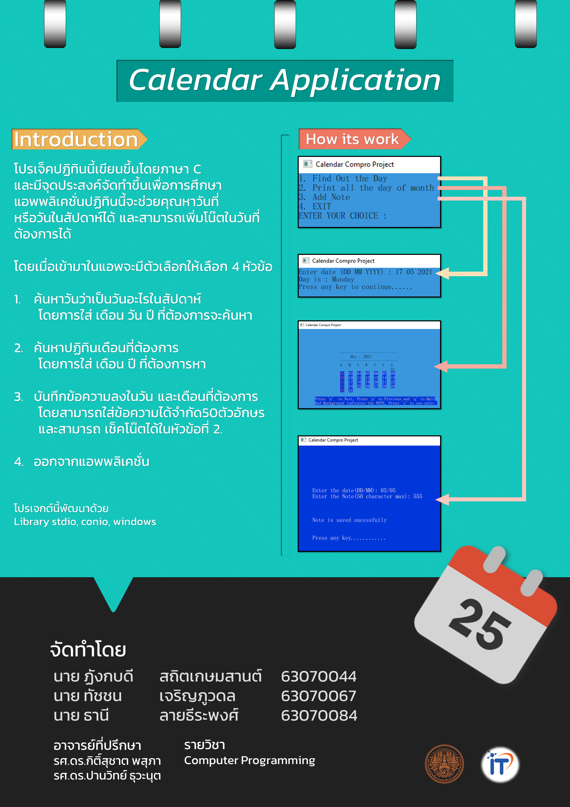

# Calendar Application
Computer Programming Project
## บทคัดย่อ
โปรแกรม "Calendar Application By GLHF" นี้มีจุดประสงค์จัดทำขึ้นมาเพื่อเป็นโปรแกรมเพื่อการศึกษา 
เป็นแอพพลิเคชั่นสำหรับผู้ที่ต้องการดูปฏิทินหรือบันทึกโน๊ตลงบนปฏิทิน และสามารถเรียกดูได้ 
โดยใช้ความรู้จากที่ได้เรียนมาจากคลาสเรียน และศึกษาเพิ่มเติมจากอินเทอร์เน็ต เพื่อให้สามารถพัฒนาได้ตามจุดประสงค์ที่วางไว้ 
โดยจะมีฟังค์ชั่นดูวันว่าเป็นวันอะไรในสัปดาห์ และดูปฏิทินรายแล้วยังสามารถบันทึกโน๊ตได้
## เว็บไซต์

## วิดีโอนำเสนอ
[Youtube](https://youtu.be/-aiTfHNaBks)
## โปสเตอร์
 [Poster (download)](https://drive.google.com/file/d/1pTgNiWkKrULAtyketxVTuIhYePELrDyf/view?usp=sharing)
 
 
---
สมาชิก
---

| รหัสนักศึกษา | ชื่อ - นามสกุล | Github |
| :-------- | :-------- |:--------- |
|   63070044   |   ฏังกบดี สถิตเกษมสานต์   |      |
|   63070067   |   ทัชชน เจริญภูวดล   |  [thatchon](https://github.com/thatchon)   |
|   63070084   |   ธานี ลายธีระพงศ์   |   [mheepandaaa](https://github.com/mheepandaaa)   |
